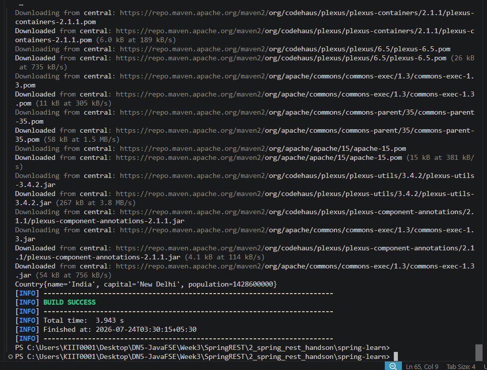

# Week 3 - Exercise 2: Spring Core – Load Country from Spring Configuration XML

**Module:** Spring REST using Spring Boot 3 (Spring Core carryover topic)
**Status:** Complete

## What this does

Defines a `Country` bean in `beans.xml` using traditional XML-based Spring
configuration (setter injection via `<property>` tags), then loads it through
`ClassPathXmlApplicationContext` — demonstrating the pre-annotation style of
Spring bean configuration, independent of Spring Boot auto-configuration.

## Verification

Running `mvn compile exec:java` builds and executes successfully, printing:

## Build Success Screenshot

