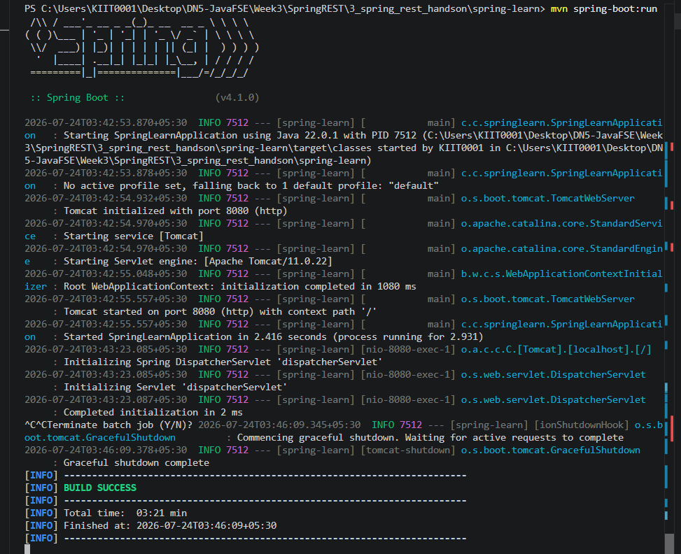
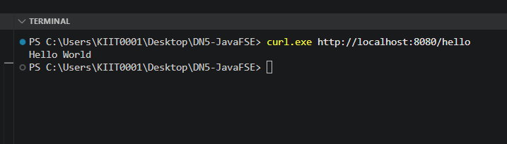

# Week 3 - Exercise 3: Hello World RESTful Web Service

**Module:** Spring REST using Spring Boot 3
**Status:** Complete

## What this does

A minimal REST controller (`HelloController`) exposing a single `GET /hello`
endpoint that returns "Hello World" as plain text, using `@RestController`
and `@GetMapping`.

## Verification

- `mvn spring-boot:run` builds and starts successfully, Tomcat listening on port 8080
- `curl http://localhost:8080/hello` returns: `Hello World`

## Screenshots

### Server Start

### Hello World Response

