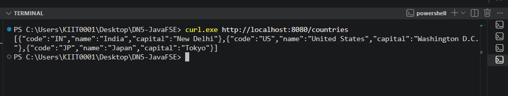
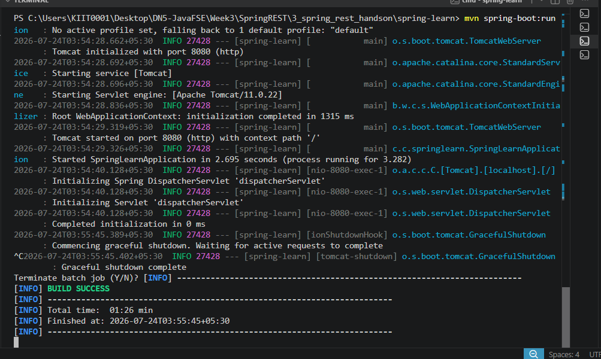

# Week 3 - Exercise 4: REST – Country Web Service

**Module:** Spring REST using Spring Boot 3
**Status:** Complete

## What this does

Adds a `Country` model, `CountryService`, and `CountryController` exposing
a `GET /countries` endpoint that returns an in-memory list of countries as JSON.

**Note:** This exercise is built on top of the same project as Exercise 3
(`../3_spring_rest_handson/spring-learn`), since it's a direct continuation
of the same REST application rather than a separate project. See that folder
for the full source, including `Country.java`, `CountryService.java`, and
`CountryController.java`.

## Verification

- `mvn spring-boot:run` (from `3_spring_rest_handson/spring-learn`) builds and starts successfully
- `curl http://localhost:8080/countries` returns:

```json
[
  { "code": "IN", "name": "India", "capital": "New Delhi" },
  { "code": "US", "name": "United States", "capital": "Washington D.C." },
  { "code": "JP", "name": "Japan", "capital": "Tokyo" }
]
```

## Screenshots

### Server Start



### Countries Response


