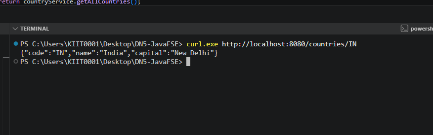
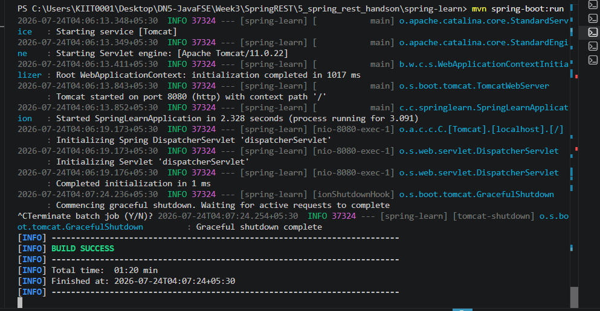

# Week 3 - Exercise 5: REST – Get Country Based on Country Code

**Module:** Spring REST using Spring Boot 3
**Status:** Complete

## What this does

Extends the Country REST service with a `GET /countries/{code}` endpoint that
looks up a single country by its code using `@PathVariable`, returning a
single JSON object instead of the full list.

## Verification

- `mvn spring-boot:run` builds and starts successfully
- `curl http://localhost:8080/countries/IN` returns:

```json
{ "code": "IN", "name": "India", "capital": "New Delhi" }
```

## Screenshots

### Server Start



### Country By Code Response


